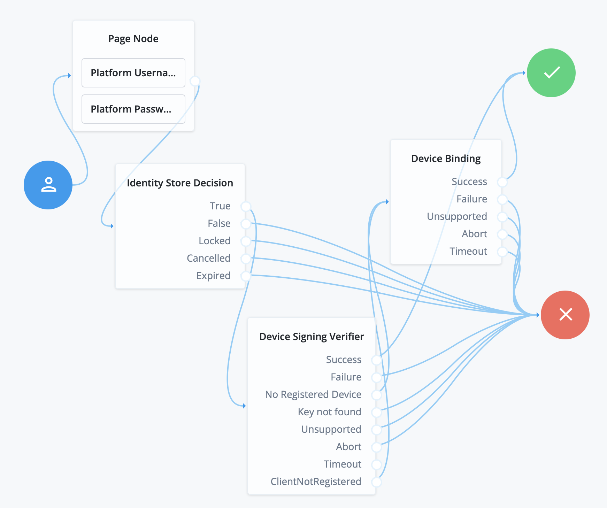
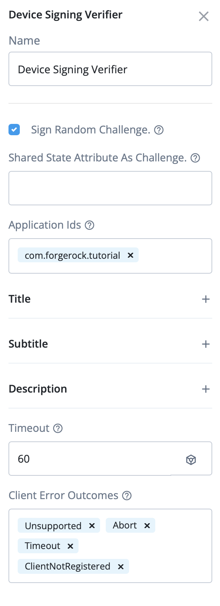
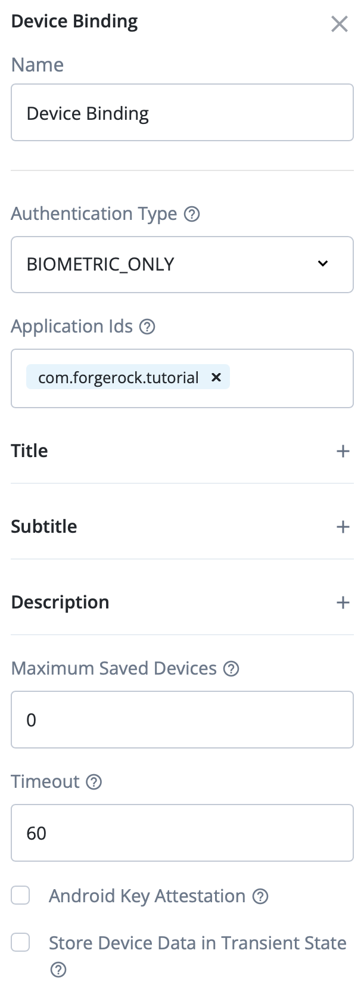
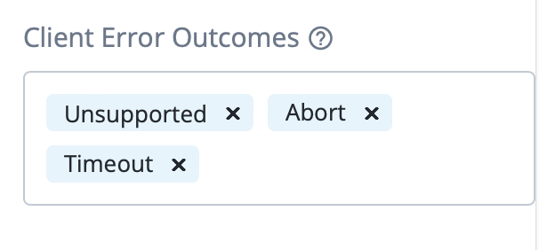

#  Device Binding (optional lab for chapter 4)

- Use the backstage documentation

- update the iOS project to use SDK 4.1.0
- import the FRDeviceBinding module
- handle the callbacks
 
- implement a journey

